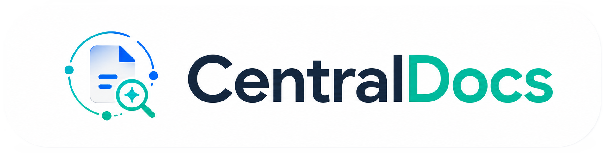
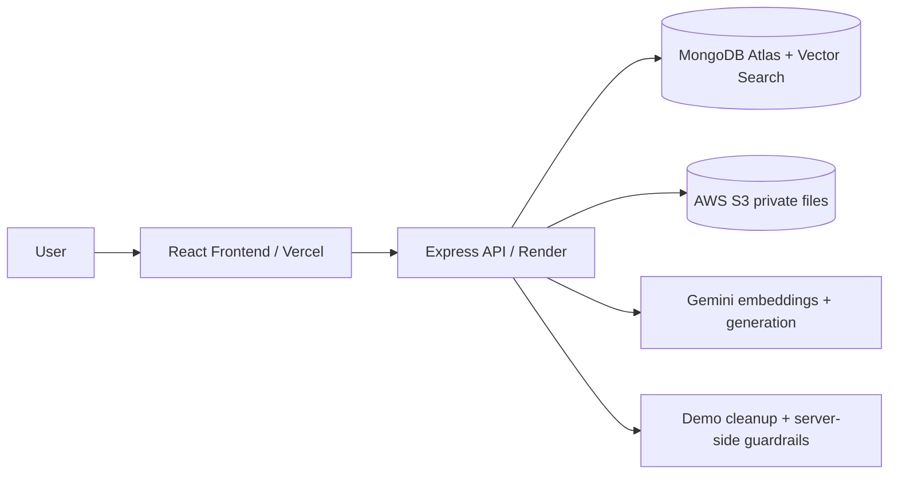

<h1 align="center">
  
</h1>

<p align="center">
  <strong>AI document workspace for digital transformation.</strong>
</p>

<p align="center">
  Manage documents, search by meaning, chat with selected sources, and generate downloadable Markdown documents with references.
</p>

<p align="center">
  
  
  
  
  
  
  
  
  
</p>

<p align="center">
  <a href="#demo-flow">Demo Flow</a>
  |
  <a href="#architecture">Architecture</a>
  |
  <a href="#engineering-highlights">Engineering Highlights</a>
  |
  <a href="#local-development">Local Development</a>
</p>

<p align="center">
  <strong>Live Demo:</strong> Coming soon
  &nbsp;&nbsp;|&nbsp;&nbsp;
  <strong>Backend API:</strong> Coming soon
</p>

---

## What Is CentralDocs?

CentralDocs is a portfolio-ready AI document workspace that turns a demo corpus of business files into searchable, cited knowledge.

> Built for document management, semantic search, grounded chat, and generated documents - without requiring a user account.

The app uses a fictional Orchid Retail digital-transformation workspace as its demo corpus. Orchid Retail is only the sample business story; CentralDocs is the product.

## Why It Matters

<table>
  <tr>
    <td><strong>Documents</strong><br />Organize folders, mock files, uploaded files, generated documents, preview, trash, restore, and download.</td>
    <td><strong>Search</strong><br />Use MongoDB Atlas Vector Search to find meaning, not just exact keywords.</td>
  </tr>
  <tr>
    <td><strong>Chat</strong><br />Ask questions against selected documents and folders, then inspect references under each answer.</td>
    <td><strong>Generate</strong><br />Turn useful conversations into Markdown documents that are stored, indexed, previewed, and downloaded like normal files.</td>
  </tr>
</table>

## Highlights

<table>
  <tr>
    <th>Core workspace</th>
    <th>AI and document intelligence</th>
  </tr>
  <tr>
    <td>
      <ul>
        <li>Compact single workspace route.</li>
        <li>Nested source tree with selected context.</li>
        <li>One-file public upload with validation.</li>
        <li>Preview, status, retry, download, trash, and restore.</li>
      </ul>
    </td>
    <td>
      <ul>
        <li>Semantic search over selected or broad scope.</li>
        <li>RAG chat with selected documents and folders.</li>
        <li>References shown below assistant answers.</li>
        <li>Generated documents become indexed workspace files.</li>
      </ul>
    </td>
  </tr>
</table>

## Demo Flow

| Step | Action | What to notice |
| --- | --- | --- |
| 1 | Launch workspace | Start or continue an anonymous demo session. |
| 2 | Select sources | Tick documents or folders in the source tree. |
| 3 | Ask a question | Chat answers use the selected context. |
| 4 | Inspect references | Expand evidence under the assistant answer. |
| 5 | Generate document | Create a Markdown summary from the chat. |
| 6 | Download or reuse | Preview, download, attach, or search the generated file. |

The demo is intentionally short-session friendly: no account wall, clear usage limits, and honest offline/provider status.

## Screenshots

Screenshots will be added after deployment.

## Architecture

CentralDocs is split into a Vercel frontend and Render backend. MongoDB Atlas stores metadata and vectors, AWS S3 stores private files, and Gemini powers embeddings and generation.



How it works:

- The frontend warms the backend, creates or resumes a demo session, and renders a compact three-zone workspace.
- The backend owns sessions, folders, documents, uploads, indexing, search, chat, generated documents, downloads, usage, and cleanup.
- MongoDB Atlas stores Mongoose records and vector-search chunks.
- S3 stores mock files, uploaded originals, and generated Markdown documents.
- Gemini creates query/document embeddings and grounded chat or document-generation output.

| Layer | Stack |
| --- | --- |
| Frontend | React 19, Vite 8, Tailwind CSS 4, local UI primitives, lucide-react, react-markdown |
| Backend | Node.js, Express 5, Mongoose, Zod, Multer, node:test, Supertest |
| Database | MongoDB Atlas metadata, sessions, documents, chunks, chats, usage, and quota windows |
| Search | MongoDB Atlas Vector Search over document chunks |
| Storage | AWS S3 private objects with presigned downloads |
| AI | Gemini embeddings and generation with fallback model lane |
| Deploy | Vercel frontend, Render backend |

## AI, Search, And References

> CentralDocs does not answer from all files blindly. It answers from the selected documents/folders and shows references under each assistant answer.

Key behavior:

- Selected documents and folders define the RAG scope.
- Search and chat exclude trashed or not-ready documents.
- The current retrieval window is widened for multi-document summaries.
- Assistant answers can cite list/range formats such as `[1, 2]` and `[1-3,5-8]`.
- References are deduplicated by source/chunk where possible.
- Assistant answers render safe Markdown without raw HTML.
- Provider keys, private prompt content, raw embeddings, and internal storage identifiers stay out of public responses.

## Engineering Highlights

| Highlight | Why it matters |
| --- | --- |
| Mongoose + Atlas Vector Search | Keeps metadata, session state, chunks, and vector retrieval in one deployment-friendly data layer. |
| Selected-context RAG | Chat responses are grounded in what the user selected, not an uncontrolled global corpus. |
| Citation-aware references | Assistant answers keep evidence visible, deduped, and close to the message that used it. |
| Generated docs as normal docs | Generated Markdown files are stored, indexed, previewable, downloadable, and reusable in future chat/search. |
| S3 download flow | Private S3 objects are accessed through backend-authorized presigned download responses. |
| Demo guardrails | Session cleanup, visible usage limits, and server-side abuse protection keep a public demo safer to host. |
| Compact workspace UX | Sources, chat/search/preview/generated work, and supporting context stay in one scannable workspace. |

## Demo Limits

> The public demo is intentionally limited to protect free-tier resources.

| Category | Limit |
| --- | --- |
| Session/data lifetime | 3 days |
| Saved chats | 5 active chats |
| AI prompts | 10 per session |
| Generated documents | 3 per session |
| Uploaded files | 5 per session |
| User-created folders | 10 per session |
| User storage | 20 MB per session |
| Generated document size | 100 KB |
| Prompt length | 1,500 characters |
| Search query length | 500 characters |

Production clear-session behavior cleans workspace data without presenting it as a quota reset. Server-side guardrails also protect the demo from repeated anonymous abuse.

## Supported Public Uploads

| Supported public uploads | Max size |
| --- | --- |
| `.txt`, `.md`, `.csv`, `.tsv` | 500 KB |
| `.docx` | 1 MB |
| `.pdf` | 2 MB or configured page cap |

Public users cannot upload images, audio, video, `.xlsx`, `.pptx`, archives, executables, or unknown binary files. The controlled mock corpus can include richer formats and media because those assets are seeded by the project.

## Mock Workspace

The seeded Orchid Retail corpus contains 16 connected demo documents across folders such as:

- Strategy & Rollout
- Document Operations
- Finance & Vendors
- Customer & Support Signals
- Meeting Evidence
- Generated Examples

Mock documents are read-only, searchable, attachable, previewable, and downloadable after seeding. Clear Session preserves mock data.

## Project Structure

```text
CentralDocs/
  backend/                  Express API, services, models, tests, mock data scripts
  frontend/                 React/Vite app and UI components
  docs/scopian/sources/     Canonical product, architecture, API, UX, and data specs
```

There is intentionally no root `package.json`. Install and run backend and frontend from their own folders.

## Local Development

<details>
<summary><strong>Backend setup</strong></summary>

```bash
cd backend
npm install
copy .env.example .env
npm.cmd test
npm.cmd run start
```

Useful scripts:

```bash
npm.cmd run seed:mock
npm.cmd run index:mock
npm.cmd run embed:mock-media
```

Run the seed/index/media scripts only when your local environment is intentionally configured for MongoDB Atlas, S3, and Gemini.

</details>

<details>
<summary><strong>Frontend setup</strong></summary>

```bash
cd frontend
npm install
copy .env.example .env
npm.cmd run dev
```

Default local URLs:

- Frontend: `http://localhost:5173`
- Backend API: `http://localhost:8080/api`

</details>

<details>
<summary><strong>Environment checklist</strong></summary>

Use the checked-in examples only:

- `backend/.env.example`
- `frontend/.env.example`

Backend configuration includes:

- allowed frontend origins.
- MongoDB Atlas connection with `/centraldocs` in the database path.
- Atlas Vector Search index `document_chunks_vector_index`.
- vector field `embedding`.
- embedding dimensions `768`.
- S3 bucket, region, and credentials.
- Gemini model/key configuration.
- demo cleanup and quota policy.

Frontend configuration includes:

- `VITE_API_BASE_URL`
- `VITE_APP_NAME`

Do not commit real environment files or credentials.

</details>

## Deployment

| Target | Root | Notes |
| --- | --- | --- |
| Vercel | `frontend/` | Configure the deployed backend API base URL. |
| Render | `backend/` | Configure MongoDB Atlas, S3, Gemini, demo quota, and client origins. |
| MongoDB Atlas | external | Create the database and Atlas Vector Search index. |
| AWS S3 | external | Keep objects private and use backend-authorized downloads. |

See the deployment preparation checklist: [docs/deployment/CENTRALDOCS_DEPLOYMENT_CHECKLIST.md](docs/deployment/CENTRALDOCS_DEPLOYMENT_CHECKLIST.md).

Deployment smoke should verify health, warm-up, dependencies, demo session/bootstrap, seeded mock data, semantic search, RAG chat, generated documents, upload/preview/download, and clear-session cleanup.

## Safety And Boundaries

- Public docs do not include private progress reports.
- Real environment files are ignored.
- `_reference/` is reference-only.
- Internal storage identifiers, raw embeddings, private prompt content, raw AI-provider payloads, and secret values must not be exposed.
- Server-side abuse guardrails are not displayed as a separate frontend quota.
- Public upload remains limited to supported document/text formats.
- Generated documents are Markdown/text only.
- Command-based chat generation and fixed document presets are outside current scope.

## Status

CentralDocs has passed local backend tests, frontend build validation, and real local live smoke with MongoDB Atlas, AWS S3, and Gemini in prior project validation. Hosted links will be added after deployment.

## License

No license file is present.
